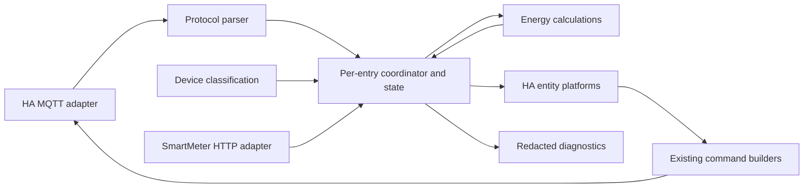

# Proposed target architecture

This design applies [AGENTS.md](../AGENTS.md) to the actual [coupling map](refactor-map.md). It is a staged proposal; no modules below have been created. The current custom coordinator can remain a plain class. Adopting HA DataUpdateCoordinator is not a prerequisite for separation.

## Smallest useful decomposition

| Module | Clear responsibility / exclusions |
| --- | --- |
| `const.py` | Integration domain/platforms and shared integration defaults. HA entity metadata stays in platforms. |
| `protocol/constants.py` | Proven message/field/enum mappings and envelope keys, with distinct host deviceType / child devType / query category concepts. No hardware support claims based on labels alone. |
| `protocol/normalization.py` | Existing field aliases and flat-body extraction with lossless raw retention. No cache freshness or HA entities. |
| `protocol/parser.py` | Decode a message and identify its known payload shape/type. Return minimal typed records or tagged structures; preserve unknown metadata safely. Do not choose which entities to create. |
| `protocol/commands.py` | Build existing control/poll payloads from explicit arguments, time and message ID. No network access, implicit optimistic state or invented commands. |
| `calculations/energy_flow.py` | Existing pure computation rules. Initial compatibility function can still mutate a dict and return it; later value-only input/output is a separate reviewed change. No timers or HA imports. |
| `devices/classification.py` | Classify real source sections/devType/subType into current groups and supported field capabilities; preserve unknown class explicitly. Avoid a class per model. |
| `devices/state.py` (only if coordinator still needs it) | Per-device cache merge/freshness state, with distinguishable raw/normalized/derived values. No registry mutation or entity construction. Initially coordinator can own these dictionaries. |
| `transport/mqtt.py` | HA MQTT subscribe/publish and unsubscribe ownership, cancellation and receipt metadata. Receives topic settings; emits messages/health events. No entity definitions. |
| `transport/smartmeter_http.py` | Optional async measurement polling, status/failure/cancellation handling; accepts current endpoint identity and interval. No MQTT cache traversal or HA sensor creation. |
| `coordinator.py` | Per-entry orchestration: choose route, apply cache transitions, run calculations, track health, schedule polling, notify entities. No generic plugin/event-bus framework. |
| `entity.py` (only after repeated lifecycle patterns are proven) | Stable device association and registration/unregistration conveniences. Do not hide differences in availability and optimistic behavior. |
| `sensor.py`, `switch.py`, `number.py`, `select.py`, `button.py` | HA metadata, stable IDs, state presentation and action-to-coordinator calls. Keep main/sub/HTTP update channels explicit. |
| `diagnostics.py` | Bounded redacted snapshot of entry runtime state, no active polling or commands. |
| `__init__.py`, `config_flow.py` | Setup/unload and registry migration; config/options/reauth UI. Construct runtime before forwarding dependent platforms once lifecycle regression tests exist. |

Do not create devices/base.py, battery.py, plug.py, solarvault.py and smartmeter.py merely to mirror model names. Current device groups can be represented by small data records and existing dictionaries. Split them only if actual independent behavior warrants it. Likewise an abstract transport base, command manager, message broker or source-quality framework is unnecessary for two concrete transports.

## Data and ownership contract

One entry owns one coordinator, its subscriptions and tasks. MQTT raw receipt → structural parse → explicit cache transition → calculations → immutable/read-only entity view. HTTP measurements use a separate data/health channel associated with the same meter; they must not be sent through an MQTT-only callback signature.

Raw payload keys remain intact. Normalized aliases are a distinct view/copy; derived values remain distinguishable from direct observations. During initial extraction, preserve the exact public/cache keys through wrappers. Later internal canonical names must not change entity unique IDs, recorder statistics, translation keys or source selection.

Future measurement records may carry value, source, receipt time and availability reason. Introduce this only to solve identified freshness/diagnostics requirements, not as a mandatory wrapper around every scalar immediately. Keep main-message receipt, child-message receipt and **field measurement freshness** separate: metadata-only cloud-mode reports do not prove fresh power. Cumulative energy can stay meaningful between sparse reports without pretending instantaneous power is current.

Existing source precedence is frozen during structural phases: first CT → first usable collector → system candidates; max-magnitude ongrid; HTTP supplemental only. This differs from the policy's illustrative hierarchy. Fixing empty CT masking, stale sources or HTTP fallback is a separate tested behavior change requiring explicit acceptance.

## Commands and compatibility

Preserve each entity's current optimistic/cache/confirmed behavior first. Later represent sent, optimistic and confirmed state separately only where protocol evidence supports correlation. Unknown acknowledgements stay unknown; never manufacture success from MQTT publish. No new services or capabilities are proposed here.

Keep existing unique IDs/device identifiers. Do not import Official's main_ suffix or host-prefixed children. Keep compatibility exports at old import paths until tests and all platforms have migrated. Every extraction is reversible by reverting one small PR and its imports; it must not require user entity cleanup or storage migration. Bugfixes, new diagnostics and selected upstream behavior follow separate acceptance gates in the [roadmap](refactoring-roadmap.md).
